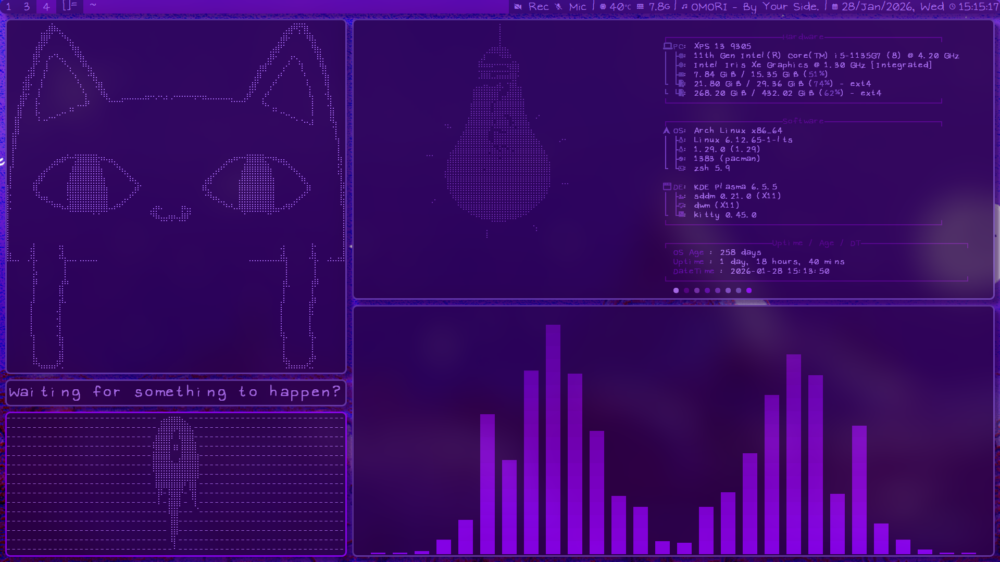

# dwm
my own build of dwm, steal it if u wanna for some unknown reason  

my [dotfiles](https://github.com/InverseThree/dotfiles) and [scripts](https://github.com/InverseThree/scripts)  

preview: 
  

patches applied (don't know if i've missed any):\
[alpha](https://dwm.suckless.org/patches/alpha/dwm-alpha-20250918-74edc27.diff)\
[bulkill](https://dwm.suckless.org/patches/bulkill/dwm-bulkill-20231029-9f88553.diff)\
[cfacts](https://github.com/bakkeby/patches/blob/master/dwm/dwm-cfacts-6.6.diff)\
[cfacts-dragfact](https://github.com/bakkeby/patches/blob/master/dwm/dwm-cfacts-dragfact-6.6.diff)\
[cfacts-vanitygaps](https://github.com/bakkeby/patches/blob/master/dwm/dwm-cfacts-vanitygaps-6.6.diff)\
[cyclelayouts](https://github.com/bakkeby/patches/blob/master/dwm/dwm-cyclelayouts-6.3.diff)\
[focusonnetactive](https://github.com/bakkeby/patches/blob/master/dwm/dwm-focusonnetactive-6.3.diff)\
[hide vacant tags](https://dwm.suckless.org/patches/hide_vacant_tags/dwm-hide_vacant_tags-6.4.diff)\
[Keychord](https://dwm.suckless.org/patches/keychord/dwm-keychord-20211210-a786211.diff)\
[losefullscreen](https://github.com/bakkeby/patches/blob/master/dwm/dwm-losefullscreen-6.6.diff)\
[pertag](https://github.com/bakkeby/patches/blob/master/dwm/dwm-pertag-6.6.diff)\
[pertag-togglelayout](https://github.com/bakkeby/patches/blob/master/dwm/dwm-pertag-togglelayout-6.6.diff)\
[placemouse](https://github.com/bakkeby/patches/blob/master/dwm/dwm-placemouse-6.6.diff)\
[resizepoint](https://github.com/bakkeby/patches/blob/master/dwm/dwm-resizepoint-6.6.diff)\
[restartsig](https://dwm.suckless.org/patches/restartsig/dwm-restartsig-20180523-6.2.diff)\
[shiftviewclients](https://github.com/bakkeby/patches/blob/master/dwm/dwm-shiftviewclients-6.6.diff)\
[statuscmd](https://dwm.suckless.org/patches/statuscmd/dwm-statuscmd-20241009-8933ebc.diff)\
[steam](https://github.com/bakkeby/patches/blob/master/dwm/dwm-steam-6.6.diff)\
[sticky](https://dwm.suckless.org/patches/sticky/dwm-sticky-6.5.diff)\
[swallow](https://github.com/bakkeby/patches/blob/master/dwm/dwm-swallow-6.6.diff)\
[switchtag](https://github.com/bakkeby/patches/blob/master/dwm/dwm-switchtag-6.6.diff)
